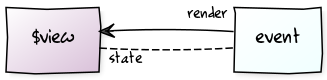
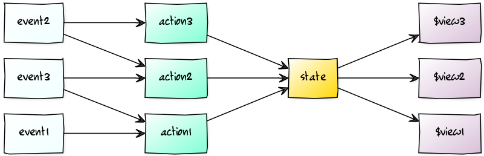
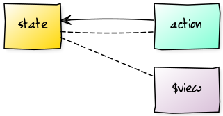

# jquery-statebus
🚍 0.5KB Small State + EventBus for jQuery

## Example
```js
var counter = $.statebus('counter', {
  state: {
    value: 0
  },
  action: {
    increment: function(number){
      return {value: this.state.value + number}
    },
    decrement: function(number){
      return {value: this.state.value - number}
    }
  }
})

var $el = $('.counter')
$el.on('click', '[data-do-counter-increment]', function(){
  counter.action.increment(1)
})
$el.on('click', '[data-do-counter-decrement]', function(){
  counter.action.decrement(1)
})

counter.on('increment decrement', function(state){
  $el.find('.txt').text(state.value)
})
```

## What?
"jquery-statebus" provides a very simple pattern for decoupling states from **views** (written in jquery).

- reduces JavaScript crash when design changes.
- easy to extend new feature.
- easier than backbone.
- small and light.

## Install
```sh
yarn install jquery-statebus
```
```js
// index.js
require('jquery-statebus');
```
### browser
```html
<script src="https://unpkg.com/jquery-statebus"></script>
```

## How to use
### State
Defines a state with namespace.

```js
var counter = $.statebus('counter', {  // namespace is 'counter'.
  state: { value: 1 }
})

// counter.state.value  == 1
// $.statebus.state.counter.value  == 1
```
`$ .statebus.state [namespace]` to get another local state.

### Action
```js
var counter = $.statebus('counter', { 
  state: { value: 1 },
  action:{
    increment: function(number){
      return {value: this.state.value + number} 
    }
  }
})

counter.action.increment(1) // "counter.state.value" to be 2
$.statebus.action.counter.increment(2) // "counter.state.value" to be 4
```
Updates state to the returned by action. (using `$ .extend`.) In action function, `this` is an object that has the `state`,` action` property.

#### Action in action
```js
$.statebus('counter', { 
  state: { value: 1 },
  action:{
    increment: function(number){
      return {value: this.state.value + number} 
    },
    delayIncrement: function(number, sec){
      setTimeout(this.action.increment, sec * 1000, number)
    }
  }
})

counter.action.delayIncrement(1, 3)
console.log( counter.state.value ) // 1

// ..after 3sec.
console.log( counter.state.value ) // 2
```

### On(action, render [, immediately])
```js
counter.on('increment', function view(state, prevState){
  if(state.value !== prevState.value){
    $display.text(state.value)
  }
})
```
jquery.statebus has no magic. Subscribe to the **action** associated with the **view**. Ccompare with the previous state.

#### Multiple
```js
// space
counter.on('increment decrement', view)

// array
counter.on(['increment', 'decrement'], view)
```
Actions that share the same **view** change exist. You can subscribe to multiple actions at once with `space`, or` array`.

#### Global
```js
$.statebus.on(['counter.increment', 'other.update'], view)
```
Changes in different states can be rendered using the same **view** function.

#### Immediately
```js
counter.on('increment', function (state, prevState){
  if(prevState === null) initView()
  $display.text(state.value)
}, true)
```

If third argument is true, render function is call immediately. Whether **prevState** is null or not can judged initial call in the function.

## Why?
Purpose of jquery-statebus is to decoupling **view** and **state**. Below is a strong coupling example of **view** and **state**.

```js
$('#counter > button.increment').click(function(){
  var $display = $('#counter span.display')
  var number = parseInt($display.text())
  $display.text(number + 1)
})
```
**state** is from **view**.

<p align="center"></p>

It is like this diagram.

<p align="center"></p>

Make increasingly complex networks. Design changes and extend new feature become difficult.

<p align="center"></p>

Decoupling **state** and **view** with jquery-statebus can improve this complexity.

<p align="center"></p>

**state** gets it from an independent object in memory, which reduces the risk of other JavaScript codes being broken by **view** design changes. Reduce the burden of knowing **view** coupling when adding new features.

## Tip
### Use data attribute.
```js
// bad
$el.find('button.increment').click(function(){
  var amount = $(this).data('do-counter-increment');
  counter.action.increment(1)
})

counter.on('increment', function(state){
  $el.find('span.display').text(state.value)
})


//good
$el.on('click', '[data-do-counter-increment]', function(){
  var amount = $(this).data('do-counter-increment');
  counter.action.increment(amount)
})

counter.on('increment', function(state){
  $el.find('[data-counter="value"]').text(state.value)
})
```
Data attributes are not constrained by **view** structures. 
This attributes is relatively free to change the **view**.
It also tells that the event is bound only by html code.

## License
MIT