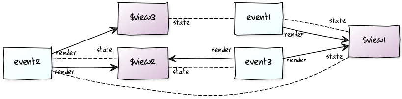

# jquery-statebus
🚍 Small state management library for jQuery

## Example
```js
var counter = $.statebus('counter', {
  state: {
    value: 0
  },

  action: {
    increment: function(number){
      return {value: this.state.value + number}
    },

    decrement: function(number){
      return {value: this.state.value - number}
    }
  }
})

var $el = $('.counter')

$el.on('click', '[data-counter="increment"]', function(counter){
  counter.action.increment(1)
})
$el.on('click', '[data-counter="decrement"]', function(counter){
  counter.action.decrement(1)
})

counter.on('increment decrement', function(counter){
  $el.find('.txt').text(counter.state.value)
})
```

## What?
jquery-statebus는 **View**(jquery로 작성된)에서 상태를 분리하는 아주 간단한 패턴을 제공합니다. 
- 디자인이 바뀔 때 자바스크립트가 망가지는 것을 최소화합니다.
- 확장이 편합니다.
- backbone 보다 더 쉽습니다.
- 작고 가볍습니다.

## Install
```sh
yarn install jquery-statebus
```
```js
// index.js
require('jquery-statebus');
```
### browser
```html
<script src="https://unpkg.com/jquery-statebus"></script>
```

## How to use
### State
state를 정의합니다.
```js
var counter = $.statebus('counter', {
  state: { value: 1 }
})

console.log(counter.state.value)
// => 1

console.log($.statebus.state.counter.value)
// => 1
```

### Action
액션 메소드를 정의합니다.
```js
var counter = $.statebus('counter', { 
  state: { value: 1 },

  action:{
    increment: function(number){
      return {value: this.state.value + number} 
    }
  }
})

counter.action.increment(1) 
// => counter.state.value === 2

$.statebus.action.counter.increment(2) 
// => counter.state.value === 4
```
액션 메소드의 반환결과가 기존 상태와 병합되어 새로운 상태를 만듭니다.
액션 메소드 안에서 `this`는  statebus 객체와 동일합니다.

#### prevState
액션 이벤트 발생 전, state를 얻을 수 있습니다.
```js
counter.action.increment(1) 

console.log(counter.state)
// => {value: 2}

console.log(counter.state.prevState)
// => {value: 1}
```
액션 이벤트가 한번도 발생하지 않았다면, prevState는 `null`입니다.

### On(action, listener [, immediately])
액션 이벤트를 구독합니다.
```js
counter.on('increment', function(){
  if(counter.state.value !== counter.prevState.value){
    $display.text(counter.state.value)
  }
})
```
jquery.statebus는 마법이 없습니다. 
직접 뷰와 연관된 이벤트를 구독하고 이전 상태와 비교해야 합니다.

#### listener(instance, context)
##### Instance
statebus 객체를 리스너의 첫번째 인자로 받을 수 있습니다.
```js
var render = function(counter){
  var value = counter.state.value
  ...
}
...
counter.on('increment', render)
```
리스너 선언 위치에서 statebus 객체를 접근하기 어려울 때, 편리합니다.

##### Context
액션 이벤트 관련 정보를 리스너의 두번째 인자로 받을 수 있습니다.
- `context.actionName` - 액션 이름
- `context.args` - 액션 매개변수
- `context.immediately` - 즉시 실행 여부. 자세한 내용 [Immediately](#immediately-) 참조.

```js
counter.on('increment', function(_, context){
  console.log(context)
})

counter.action.increment(10)
// => {actionName: "increment", args: [10], immediately: false}
```

#### Immediately
3번째 인자가 true면 함수를 즉시 1회 실행합니다. 

```js
counter.on('increment', function (){ ... }, true) // <-- !!여길 보세요!!
```

#### Unsubscribe
`on()`메소드는 구독해제 함수를 반환합니다. 
원하는 시점에 구독을 취소할 수 있습니다.

```js
var unsubscribe = counter.on('increment', function(){ ... })
unsubscribe()
```

#### Multiple subscription
```js
counter.on('increment decrement', view)
// 또는
counter.on(['increment', 'decrement'], view)
```
여러 액션 이벤트의 공통 리스너 함수가 존재하면, 
공백이나 배열로 여러 액션 이벤트를 구독할 수 있습니다.

#### Global subscription
```js
$.statebus.on(['counter.increment', 'other.update'], view)
```
이름를 사용해서 서로 다른 지역 상태에 대한 변경을 같은 리스너로 구독할 수 있습니다.

### Override
```js
$.statebus('test', {
  state: { v1: 1 }
})
var re = $.statebus('test', {
  state: { v2: 2 }
})

console.log( re.state ) // {v1: 1, v2: 2}
```
다시 재정의되면 이전 정의를 유지하며 확장합니다.

```js
$.statebus('test', {
  state: { v1: 1 }
})
var re = $.statebus('test', {
  state: { v2: 2 }
}, true) // Look here.

console.log( re.state ) // {v2: 2}
```
오버라이드 옵션이 true면, 이전 정의(상태, 액션, 이벤트 리스너) 모두를 지우고 새로 정의합니다.

### Remove
```js
// 생성
$.statebus('counter', { ... })

// 제거
$.statebus.remove('counter')
```
remove 메소드를 사용해 생성된 상태, 액션을 제거할 수 있습니다.

## Why?
jquery-statebus는 **View**와 **State**를 분리하는 게 목적입니다. 
아래는 **View**와 **State**가 강하게 결합된 코드입니다.

```js
$('#counter > button.increment').click(function(){
  var $display = $('#counter span.display')
  var number = parseInt($display.text())
  $display.text(number + 1)
})
```
**View**에서 **State**를 얻습니다. 

<p align="center"></p>

이것을 도형화한 것입니다.

<p align="center"></p>

기능이 늘어날수록 복잡한 네트워크를 만듭니다. 디자인변경, 기능추가가 힘들어집니다.

<p align="center"></p>

jquery-statebus로 **State**와 **View**를 분리하면 이러한 복잡성을 개선할 수 있습니다.

<p align="center"></p>

**State**를 메모리에 있는 독립된 객체에서 얻기 때문에 디자인 변경으로 다른 자바스크립트 코드가 망가지는 일을 최소화할 수 있습니다. 
새로운 기능을 추가할 때도 **View** 역할까지 파악해야 하는 부담이 줄어듭니다.

## Tip
### Use data attribute.
```js
// bad
$el.find('button.increment').click(function(){
  var amount = $(this).data('amount');
  counter.action.increment(amount)
})

counter.on('increment', function(counter){
  $el.find('span.display').text(counter.state.value)
})

//good
$el.on('click', '[data-counter="counter"]', function(counter){
  var amount = $(this).data('params');
  counter.action.increment(amount)
})

counter.on('increment', function(counter){
  $el.find('[data-counter="value"]').text(counter.state.value)
})
```
데이터 속성은 **View** 구조에 구속되지 않습니다. 
**View** 변경에 비교적 자유로운 속성입니다.
또 html 코드만으로 이벤트가 바인딩됨을 알려주는 역할도 합니다.

### jquery-statebusking
[jquery-statebusking](https://github.com/skt-t1-byungi/jquery-statebusking) - statebus를 backbone처럼 사용할 수 있습니다.

## License
MIT